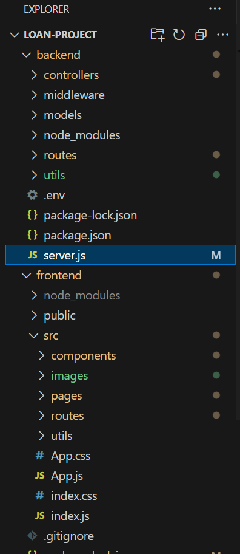
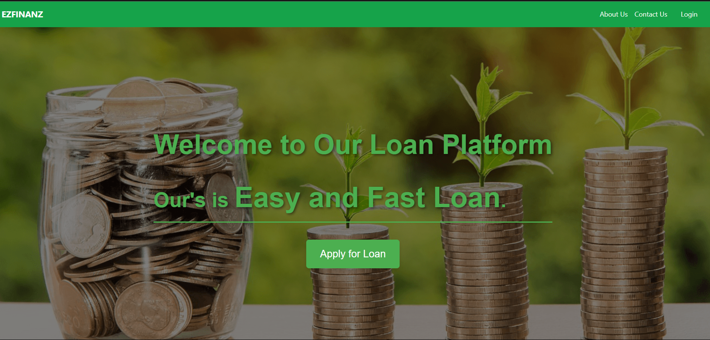
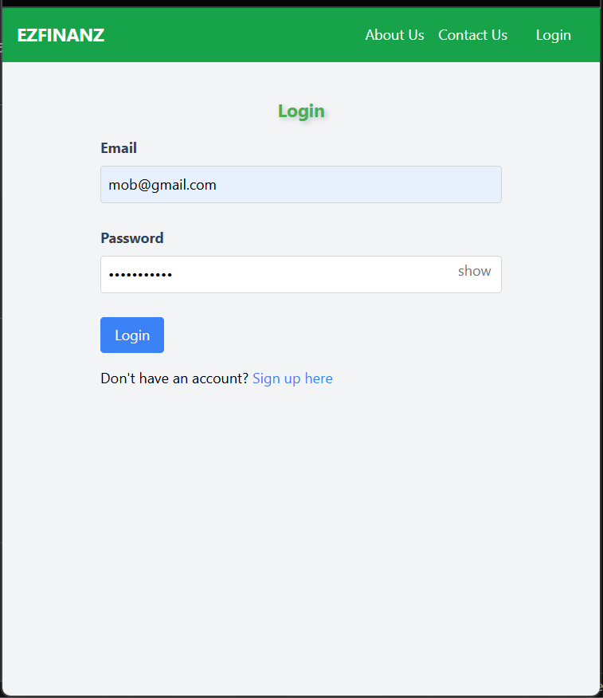
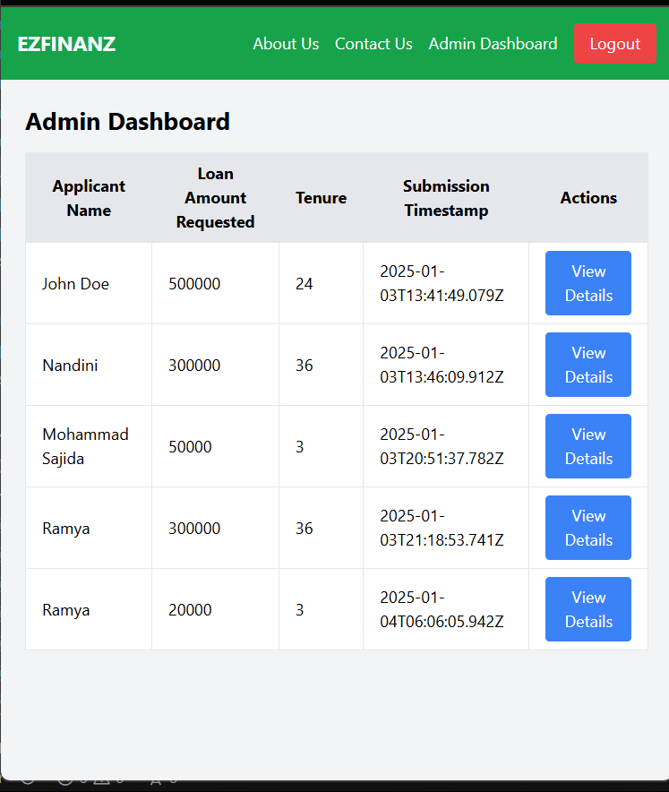
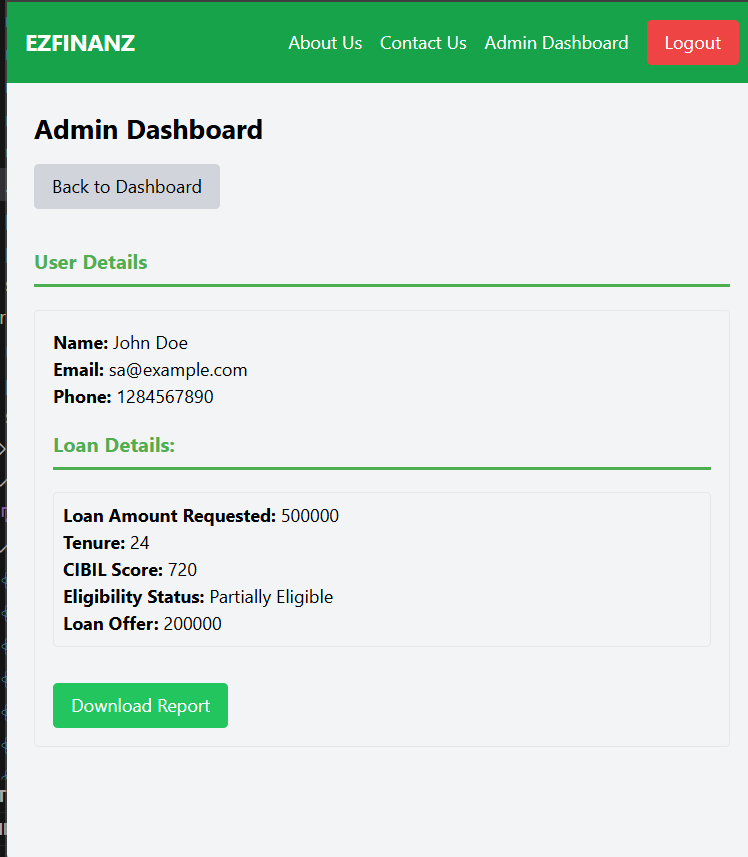
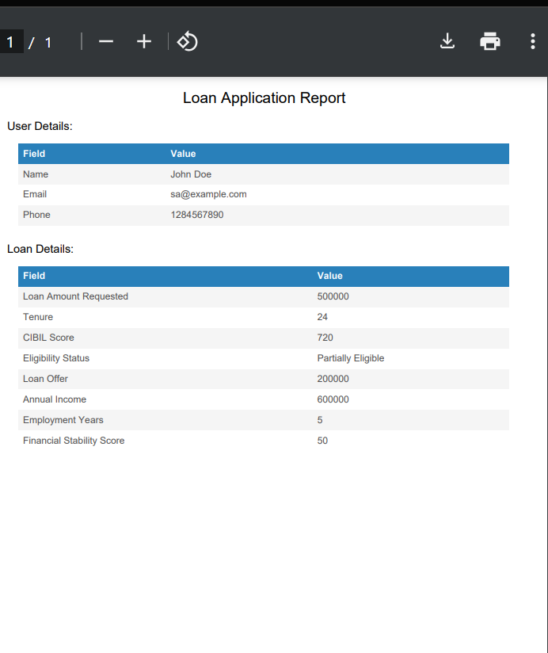

# Loan Application Management System  

## Description  
Developed an end-to-end MERN stack application for loan onboarding, integrating secure user authentication using JWT, password hashing with bcrypt, and role-based access. Implemented a responsive React frontend and an Express backend with MongoDB for database management.  

---
## Technology Stack
- **Frontend**: React.js, CSS
- **Backend**: Node.js, Express.js
- **Database**: MongoDB
- **Authentication**: JWT and bcrypt

---

## Project Structure  
The repository contains:  
- **frontend/**: React application for the user interface.  
- **backend/**: Node.js and Express.js API server for handling requests and managing the MongoDB database.  

---

## Features  
- **User Authentication**: Secure login and registration with password hashing (bcrypt) and JWT-based session handling.  
- **Role-Based Access**: Separate features for users and administrators.  
- **Loan Management**:  View loan applications and evaluate credit worthiness.  
- **Responsive UI**: User-friendly interface designed with React and CSS.  
- **Data Validation**: Backend validation for all user inputs.  
- **API Integration**: RESTful APIs for seamless frontend-backend communication.  

---

## Directory structure

---
## Project images - find in loan_ss

